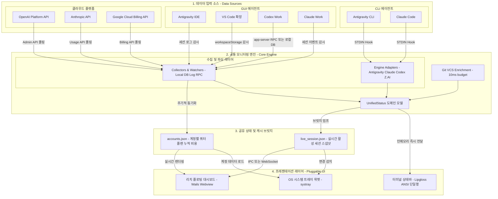

# Reference: Statusline Cumulative Architecture

이 문서는 `statusline`의 점진적·누적 재활용(Cumulative Architecture) 구조를 정의합니다. CLI 단계에서 구축된 어댑터, 수집기, 데이터 모델은 일회성으로 버려지지 않고, GUI 에이전트 수집기와 OS 트레이 위젯, Wails 대시보드에 100% 동일 부품으로 재사용됩니다.

---

## 1. 전체 아키텍처 다이어그램 (Mermaid)

---

## 2. 레이어별 역할 및 재활용 원칙

1. **데이터 소스 (Inputs)**:
   - CLI의 STDIN 훅, GUI의 로컬 로그/DB 감시, 클라우드 공식 API를 입력 채널로 둡니다.
2. **코어 엔진 (Core Engine)**:
   - 모든 입력은 `internal/adapter`와 `internal/collect`를 거쳐 단일 포맷인 `model.UnifiedStatus` 구조체로 표준화됩니다.
   - 이 코어 로직은 CLI, 백그라운드 데몬, 위젯 앱 어디서나 동일하게 import되어 재사용됩니다.
3. **공유 상태 브릿지 (Bridge)**:
   - 터미널 CLI는 초저지연(<5ms)으로 화면을 그리면서 동시에 `~/.cache/statusline/live_session.json`에 스냅샷을 덤프합니다.
   - 위젯과 대시보드는 이 표준 캐시 파일을 구독(Consume)하여 화면을 갱신합니다.
4. **프레젠테이션 (Outputs)**:
   - UI 껍데기만 Lipgloss(CLI) ➔ systray(트레이) ➔ Wails(웹뷰)로 교체되며, 비즈니스 로직과 데이터 파이프라인은 100% 공유됩니다.

