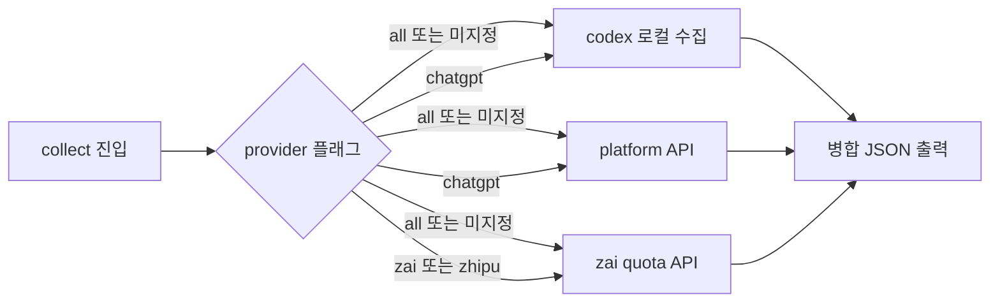

# Collect 전 Provider 통합 설계

> **Status**: Draft
> **Date**: 2026-09-26
> **Scope**: `statusline collect` 서브커맨드 CLI 시맨틱스 및 provider 통합

## 목차

- [배경](#배경)
- [목표 및 비목표](#목표-및-비목표)
- [현재 상태 실측](#현재-상태-실측)
- [설계](#설계)
- [gemini-antigravity-처리](#gemini-antigravity-처리)
- [테스트 전략](#테스트-전략)
- [리스크 및 트레이드오프](#리스크-및-트레이드오프)
- [향후 작업](#향후-작업)

## 배경

`statusline collect`는 provider별로 개별 실행해야 한다. 기본 실행은 Codex+Platform만 출력하고, Z.AI는 `--provider=zai`로만 조회된다. 사용자 요구는 "collect 한 번에 수집 가능한 모든 provider(chatgpt, zai)가 나오고, `--provider`로 선택 필터링"이다. `--cli=`는 렌더 모드의 CLI 구분자로서 collect와 역할이 분리된다.

## 목표 및 비목표

**목표**

1. `statusline collect` 기본 실행이 수집 가능한 전 provider 계정을 단일 JSON으로 병합 출력 — provider(계정)는 출력 키로 매핑된다: `chatgpt` → `codex`+`platform` 키, `zai` → `zai` 키
2. `--provider=<name>` 필터로 단일 provider 선택
3. provider별 독립 fail-soft — 한 provider 실패가 전체를 깨지 않음
4. Z.AI TTL 캐시와 렌더 브리지의 일관성 유지

**비목표**

1. gemini(antigravity) 수집 — [gemini-antigravity-처리](#gemini-antigravity-처리) 참조. agy 앱 측정 경로로 분리
2. `watch` 서브커맨드 변경
3. 기존 `--cli` 값(`claude`, `codex`, `antigravity`)의 렌더 동작 변경 — 정식 이름(`claudecode`, `agy`)은 별칭 추가만
4. 신규 provider 추가(claude 등)
5. 출력 JSON 최상위 키의 provider 명명 전환(`codex`→`chatgpt` 등) — 키는 데이터 소스 명명을 유지한다(네이밍 체계의 매핑 근거)

## 현재 상태 실측

2026-09-26 실측 기준 (`cmd/statusline/main.go:52-118`):

| 실행 | 출력 | 비고 |
| :--- | :--- | :--- |
| `statusline collect` | `{"codex":…, "platform":…}` | Admin key 없으면 `platform` 생략, 오류는 `errors` 키 |
| `statusline collect --provider=zai` | `{"zai":…}` | 자격 증명 없으면 exit 1 + stderr |
| `--provider` 기타값 | 기본 경로와 동일 | 알 수 없는 값 무시 |

`--provider=` 인자는 수동 문자열 스캔으로만 처리되며, Go `flag` 패키지와 무관하다.

## 설계

### CLI 시맨틱스

```text
statusline collect                      # 전 provider 병합 (기본 = --provider=all)
statusline collect --provider=all       # 위와 동일
statusline collect --provider=chatgpt   # codex + platform (ChatGPT/OpenAI 계정 묶음)
statusline collect --provider=zai       # zai 단독 (zhipu 별칭 유지)
```

`chatgpt` 필터가 platform을 포함하는 이유: platform은 Admin key 조건부 부속 데이터로 codex 계정과 묶여 소비된다(v0.4.0 계약). 별도 `--provider=platform`은 YAGNI.

### 네이밍 체계

두 축을 엄격히 분리한다:

| 축 | 의미 | 값 |
| :--- | :--- | :--- |
| `--cli` | statusline을 구동하는 호스트 CLI 도구 | `claudecode`, `codex`, `agy` |
| `--provider` | quota를 소유한 AI 서비스 계정 | `chatgpt`, `anthropic`, `zai`, `gemini` |

- 기존 `--cli=claude`/`--cli=antigravity` 값은 하위호환 별칭으로 유지하고 정식 이름을 `claudecode`/`agy`로 추가한다
- 출력 JSON 최상위 키(`codex`, `platform`, `zai`)는 **데이터 소스 명명을 유지**한다 — 이미 배포된 소비 계약이며, provider(계정)는 필터 단위로 출력 키와 매핑 관계다: `chatgpt` → `codex`+`platform`, `zai` → `zai`
- 별칭 정책: `zhipu`는 기존 호출 값 존재로 유지, `openai` 등 신규 별칭은 추가하지 않는다
- `anthropic`은 v0.6.0 구현 예정 — 현재는 "not yet supported" 메시지와 함께 거부
- `gemini`는 [gemini-antigravity-처리](#gemini-antigravity-처리) 결정에 따라 agy 앱 측정 경로 확정 전까지 동일하게 거부

### 출력 스키마

기본(all) 실행:

```json
{"codex":{}, "platform":{}, "zai":{}, "errors":{}}
```

- 각 provider 키는 수집 성공 시에만 존재
- 자격 증명 부재는 에러가 아니다 — 해당 키를 조용히 생략 (기존 platform 동작과 일치)
- 자격 증명은 있으나 조회 실패(HTTP 오류, 타임아웃) 시 `errors.<provider>`에 메시지 기록
- `errors`가 비면 `null` 생략 (기존 동작 유지)

### 실행 구조



- provider별 고루틴 병렬 수집 — 순차 실행 시 zai 5s + platform 5s가 전체 예산을 초과
- **병합은 메인 고루틴에서 단일 수행** — 각 고루틴은 자기 결과를 반환(채널)할 뿐 공유 map에 쓰지 않는다. Go map 동시 쓰기는 런타임 패닉이므로 `errors` 맵도 고루틴이 직접 쓰지 않는다
- 자격 증명 로드(credentials.json, env)는 메인 고루틴에서 1회 수행해 결과를 각 고루틴에 주입한다 — `errors.credentials` 키 소유권은 메인에만 있다
- 모든 수집기는 공유 context(10s 예산)를 받는다 — 로컬 조회 포함 취소 전파
- 각 HTTP 클라이언트 타임아웃 5s 유지
- zai 수집은 기존 `collect.RunZaiCollect` 재사용 — 매 실행 시 동기 API 조회 후 캐시(`~/.cache/statusline/zai.json`)·리프레시 파일 갱신 (TTL 없음. TTL 스테일-리드·백오프는 렌더 브리지 `AttachZaiQuota` 계약이며 collect와 무관). 렌더 브리지와 동일 캐시를 공유하므로 collect 실행이 렌더 스테일-리드를 갱신한다

### 오류 계약

| 상황 | stdout | stderr | exit |
| :--- | :--- | :--- | :--- |
| 기본/all — provider 조회 실패 | `errors.<provider>` 기록 | 없음 | 0 |
| 기본/all — 자격 증명 부재 | 해당 키 생략 | 없음 | 0 |
| 기본/all — 자격 증명 파일 읽기 오류 | `errors.credentials` 기록 (현행 AdminKey 계약 유지) | 없음 | 0 |
| `--provider=zai` 단독 — 자격 증명/env 부재 | 없음 | 오류 메시지 | 1 |
| `--provider=zai` 단독 — 조회 실패 | `{"errors":{"zai":…}}` | 없음 | 0 |
| `--provider=chatgpt` 단독 — 자격 증명(Admin key) 부재 | `codex`만 출력, `platform` 생략 | 없음 | 0 |
| 전 provider 조회 실패 / 자격 증명 전무 | `{"errors":{…}}`만 출력 | 없음 | 0 |
| 알 수 없는 `--provider` 값 | 없음 | 오류 메시지 | 2 |
| `anthropic`/`gemini` | 없음 | not yet supported | 2 |
| `--provider` 중복 지정 | 마지막 값 우선 (현행 수동 스캔 관행) | 없음 | - |
| 빈 값(`--provider=`) | 미지정과 동일(all) | 없음 | - |
| `--provider` 단독 토큰(공백 형식) | 없음 | `--provider: expected =value` 오류 | 2 |
| `--cli`와 동시 지정 | `collect` 서브커맨드 우선 | `--cli is not supported for collect` 경고 1회 | - |

### 단독 모드 하위호환

`--provider=zai` 단독 실행은 현행 계약 유지 — 자격 증명 없으면 exit 1 + stderr. 기본(all) 모드에서만 생략 시맨틱스를 적용한다. 기존 소비자(스크립트, 문서 예제)가 exit code로 자격 증명 부재를 감지하는 경로를 보존한다.

### 구현 범위

- `cmd/statusline/main.go` — collect 분기 재구성. provider 선택 로직 함수로 추출 (`selectProviders(arg string) []string` 등), zai 분기와 기본 경로 통합. `--cli` 정식 이름 `claudecode`/`agy`는 main.go에서 기존 값(`claude`/`antigravity`)으로 정규화해 adapter에 전달 — `internal/adapter/auto.go` 기존 분기는 무수정
- `internal/collect/` — 변경 없음 (기존 수집기 재사용)
- `docs/okf/how-to-guides/use-codex.md` — collect CLI 시맨틱스 갱신
- `ROADMAP.md` — v0.8.0 통합 수집 항목의 codex+zai 부분 완료 표기

## gemini-antigravity-처리

**결정: 이번 범위에서 제외하고, 측정 주체를 agy 앱 쪽에 둔다.**

근거(2026-09-26 probe 실측):

1. Antigravity quota는 statusline 렌더 시점 stdin payload로만 제공된다
2. 로컬 스토어 어디에도 quota 키가 없다 — `~/.gemini/antigravity/`(conversations, brain), `~/.gemini/antigravity-cli/`, `~/.config/antigravity/app_storage.json` 전수 grep 무관
3. 따라서 statusline collect가 읽을 독립 소스가 존재하지 않는다

향후 경로(우선순위순):

1. **agy 앱 측정**: Antigravity 앱 체인에서 quota를 측정·노출하고 statusline이 소비 — 데이터 근접성이 가장 높다. 구체 형태(로컬 파일 dump, API)는 agy 측 검증 후 확정
2. **v0.8.0 로컬 감시 어댑터**: `~/.gemini/antigravity/` 세션·브레인 로그 감시 — quota 이외의 사용량 데이터가 대상

## 테스트 전략

TDD로 진행:

1. **단위 — provider 선택**: `all`/미지정 → 전체, `chatgpt` → codex+platform, `zai`/`zhipu` → zai, `anthropic`/`gemini` → "not yet supported" 거부, 그 외 알 수 없는 값 → 오류 메시지 + exit 2 (현재는 무시되어 기본 경로로 흘러감 — 명시적 거부로 변경)
2. **통합 — 병합 출력**: httptest 목 서버로 zai 성공 + codex 성공 시 두 키 동시 출력 확인, `go test -race`로 병렬 병합 무경쟁 검증
3. **통합 — fail-soft**: zai 자격 증명 없는 환경에서 기본 실행이 codex만 출력하고 exit 0
4. **실측**: 빌드 후 `statusline collect`에 `codex`+`zai` 동시 출력, `--provider=zai` 단독 출력 확인

## 리스크 및 트레이드오프

| 항목 | 내용 | 대응 |
| :--- | :--- | :--- |
| API 호출 증가 | 기본 collect가 매번 zai quota API 동기 호출(RunZaiCollect는 TTL 없음) | collect는 수동 실행이라 빈도 제한됨. 렌더 경로 스테일-리드 TTL·백오프는 영향 없음 |
| 병렬 구현 복잡도 | 고루틴 + 에러 수집 | provider 3개 고정, `sync.WaitGroup` 수준으로 최소화 |
| 알 수 없는 provider 거부 | 기존 `--provider=foo`가 기본 경로로 흘러가던 관행 변경 (breaking) | exit 2 + stderr 메시지. 릴리스 노트·CHANGELOG에 마이그레이션 명시 |
| 오프라인/네트워크 불안정 | 기본 collect가 zai API 동기 호출로 최대 5s 지연 | 자격 증명 없는 환경은 호출 자체를 생략(계약상 생략 경로). 실패는 `errors.zai` 기록 후 계속 |

## 향후 작업

1. agy 앱 기반 gemini quota 노출 방식 검증 (별도 spike)
2. `--provider=` 인자의 `flag` 패키지 정규화 — 서브커맨드 인자 체계 전반 정리는 별도 과제
3. claude provider 수집 (v0.6.0 Anthropic 연동 시점)
