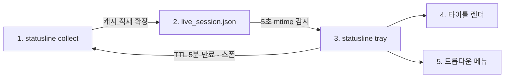

# GUI 트레이 위젯 설계 (v0.8.1 macOS / v0.8.5 Windows)

> **Status**: Draft
> **Date**: 2026-09-27
> **Scope**: `statusline tray` 서브커맨드, `live_session.json` 통합 캐시, macOS 메뉴바(v0.8.1) / Windows 트레이(v0.8.5) 표시

## 목차

- [배경](#배경)
- [목표 및 비목표](#목표-및-비목표)
- [라이브러리 계약](#라이브러리-계약)
- [설계](#설계)
- [오류 계약](#오류-계약)
- [테스트 전략](#테스트-전략)
- [리스크 및 트레이드오프](#리스크-및-트레이드오프)
- [향후 작업](#향후-작업)

## 배경

ROADMAP v0.8.0. 트레이는 collect 캐시 파일을 읽어 표시하는 **독립 기능**이다 — IDE 에이전트 감시·데몬(v1.1.0)과 데이터 의존이 없다. 현재 캐시 파일은 `zai.json`뿐이며 codex/platform 스냅샷은 collect stdout으로만 나오므로, 전 provider 캐시 적재(`live_session.json`)가 선행 과제다. 기존 자산 — atomic write(tmp+rename), refresh marker(O_EXCL 스톰 가드), mtime TTL 판정, `SpawnSelfCollect` — 을 그대로 확장한다.

용어 정리(로드맵 재편 합의): **GUI = 트레이 위젯(표시 계층)**, 감시 대상은 **IDE 에이전트**(v1.1.0).

## 목표 및 비목표

**목표**

1. **v0.8.1 macOS** 메뉴바 위젯 — 텍스트 타이틀(`SetTitle`) + 드롭다운 메뉴
2. collect 전 provider 캐시 적재 — `live_session.json` 표준화 (v1.1.0에서 조기 이관)
3. 캐시 mtime 감시 + TTL 만료 시 자가 스폰 갱신 — zai 어태치 패턴 대칭
4. 타이틀 = 메인 provider 잔여 요약 (기본 `zai`), 드롭다운에서 메인 전환 — `config tray.primary` 저장
5. **v0.8.5 Windows** 트레이 — 아이콘 + 툴팁(`SetTooltip`) + 우클릭 팝업, 공통 로직 100% 재사용

**비목표**

1. IDE 에이전트 감시·데몬·IPC/소켓 — v1.1.0
2. 다중 계정 표시 — v0.7.0 완료 후 확장
3. 아이콘 커스터마이징·OS 알림 — v2.0.0
4. ANSI 색상 — 메뉴바 타이틀은 plain text
5. Linux 트레이 — systray가 지원하나 당면 사용 환경 아님. 요청 시 v0.8.x 내 추가

## 라이브러리 계약

`fyne-io/systray`. 2026-09-27 기준 공식 README 기준이나 세부는 **Unverified — 구현 시점 실측으로 확정한다**.

| 항목 | 값 |
| :--- | :--- |
| 진입 | `systray.Run(onReady, onExit)` — **main goroutine에서 직접 호출 필수** (macOS AppKit 런루프 제약) |
| 타이틀 | `SetTitle(string)` — macOS 메뉴바 상시 텍스트. Windows 동작은 Unverified (무시 또는 툴팁 폴백 가능) |
| 툴팁 | `SetTooltip(string)` — Windows 트레이 호버 표시로 사용 |
| 메뉴 | `AddMenuItem(title, tooltip)` + `SetIcon` — macOS 좌클릭 드롭다운 / Windows 우클릭 팝업 |
| 종료 | `Quit()` 호출 시 onExit 실행 |

## 설계

### 데이터 흐름



### live_session.json (`internal/collect/live_cache.go` 신규)

```go
type LiveSession struct {
    FetchedAt time.Time                  `json:"fetchedAt"`
    Codex     map[string]json.RawMessage `json:"codex,omitempty"`
    Platform  *PlatformSnapshot          `json:"platform,omitempty"`
    Zai       *ZaiSnapshot               `json:"zai,omitempty"`
}
```

- 경로: `os.UserCacheDir()/statusline/live_session.json` (`zai.json` 대칭)
- 쓰기: `runCollect`에서 stdout 인코딩 성공 후 적재. **병합 정책** — 기존 캐시를 읽어 이번에 성공한 provider 필드만 교체하고 나머지는 유지(`--provider=zai` 단독 수집이 chatgpt 데이터를 지우지 않는다). 성공 provider가 0개면 기존 캐시를 그대로 둔다. atomic write(tmp+rename)
- `FetchedAt`: 이번 쓰기 시각(UTC). **TTL은 mtime이 아닌 `FetchedAt` 기준**(5분) — 외부 복사·터치에 강건
- 읽기: 파손 JSON·부재는 실패로 흡수 (호출자 책임 — `ReadZaiCacheAt` 관행 대칭)
- **`zai.json`은 기존 CLI 어태치 경로 그대로 병행 유지** (마이그레이션 최소화). zai 이중 기록은 의도된 것 — `zai.json`은 CLI 어태치 전용, `live_session.json`은 트레이 전용. 통합은 v1.1.0
- `ZaiSnapshot.WeeklyRemaining`(주석 "기록 전용, 표시 미사용")을 트레이 타이틀이 첫 소비자로 사용 — 주석 갱신 포함

### 트레이 구동 (`cmd/statusline/traycmd.go` + `internal/tray`)

- 배선: main.go 서브커맨드 분기에서 `tray` 감지 → `systray.Run(tray.OnReady, tray.OnExit)` 콜백 등록 — systray import는 traycmd/tray 패키지로 국한, 다른 패키지로 새지 않는다
- 폴링: 5초 간격 캐시 읽기 (fsnotify 미사용 — 의존성 최소)
- 갱신 조건 3종 — 모두 동일 경로(marker 획득 → 스폰): ① 캐시 부재 ② 읽기 실패(파손 포함) ③ `FetchedAt` 기준 TTL 5분 만료. 최초 실행(파일 없음)도 ①으로 즉시 수집된다
- refresh marker(`live_session.json.refresh`, `O_EXCL` 60s): 스폰 실패·완료 시 모두 **제거**(`ClearZaiRefreshAt` 패턴 대칭) — marker가 남으면 다음 폴링이 재획득하지 못한다. CLI zai 어태치의 스폰은 기존 `zai.json.refresh`(별도 marker)를 쓰며 두 스폰이 동시에 떠도 collect는 멱등적이라 무해하다
- 드롭다운 "지금 갱신": marker 우회 즉시 스폰. 진행 중 스폰이 있으면 요청 병합(중복 스폰 없음)

### 타이틀 렌더 (순수 함수 — `internal/tray/render.go`)

systray 없이 단위 테스트 가능한 레이어. 잔여율은 0.0~1.0 → 퍼센트 반올림.

| 메인 provider | 타이틀 | 소스 |
| :--- | :--- | :--- |
| `zai` | `z87 w45` | `TokenRemaining`(5h), `WeeklyRemaining`(주간) |
| `chatgpt` | `c80` | codex 로컬 `rate_limits` 잔여 최솟값. 미제공 시 `c-` |
| 캐시 부재/파손/전 provider 오류 | `…` | — |

파싱 규칙: codex `rate_limits`의 경로·창 선택은 구현 시점 실측 응답으로 확정한다(미제공·malformed는 `c-`로 흡수). zai `WeeklyRemaining`은 omitempty라 0%와 부재를 구분하지 않으며, 부재 시 `z87` 형태로 축소 표기한다.

### 드롭다운 메뉴

```text
statusline (fetched 12:34)
── zai ──
  5h 87% · reset 17:20
  MCP 45% · reset 10-31
── chatgpt ──
  rate 80% · plan pro
── 메인 전환 ──
  ✓ zai
  ○ chatgpt
── 지금 갱신
── 종료
```

- provider 상세: zai — 5h/MCP 잔여 + 리셋 시간(Unix ms → 로컬 타임). chatgpt — rate 잔여 + 플랜
- 메인 전환: 체크 토글 → config `tray.primary` 갱신·저장, 타이틀 즉시 재렌더
- 플랜 표기는 codex 스냅샷에서 파생 가능한 경우만 (없으면 미표시)

### 설정

config(`statusline init` 관리 파일)에 `tray` 섹션 추가 — `tray.primary: "zai"` (유효값: `zai`, `chatgpt`). 폴링 주기·TTL은 상수 고정 (설정화는 수요 발생 시).

### 플랫폼 차이

| 구분 | macOS (v0.8.1) | Windows (v0.8.5) |
| :--- | :--- | :--- |
| 상시 표시 | 메뉴바 텍스트 타이틀 `SetTitle` | 트레이 아이콘 + 툴팁 `SetTooltip` |
| 메뉴 | 좌클릭 드롭다운 | 우클릭 팝업 |
| 공유 | 캐시 감시·TTL·스폰·메뉴 구성·문자열 생성 — 동일 코드 | 동일 |

- `internal/tray`에 플랫폼 분기 없음 — 표시 호출(SetTitle vs SetTooltip)만 진입점(traycmd)에서 `runtime.GOOS`로 차등. Windows `SetTitle` 동작은 Unverified이므로 v0.8.1에서는 macOS 경로만 실측하고 Windows 빌드는 `GOOS=windows` 크로스 컴파일 준비만
- 검증 환경 부재로 Windows 실측·릴리스는 v0.8.5 마일스톤에서 수행

## 오류 계약

전 경로 fail-soft — 트레이 프로세스가 크래시로 종료되지 않는다.

| 상황 | 동작 |
| :--- | :--- |
| 캐시 부재/파손/전 provider 오류 | 타이틀 `…`, 드롭다운 "데이터 없음" + 즉시 갱신 스폰 |
| provider 부분 실패 | 해당 항목 생략("데이터 없음"), 나머지 정상 표시 — 캐시가 성공 provider만 기록하므로 실패·미수집을 구분하지 않는다. chatgpt 번들의 부분 실패(codex 성공·platform 실패)는 `Platform` 필드 부재로 표현 |
| 스폰 실패 | 에러 출력 없음, marker 제거 후 다음 폴링(5s) 재획득 |
| 캐시 디렉터리 생성/쓰기·rename 실패 | 트레이 계속 동작, 타이틀 `…`, 다음 폴링 재시도 |
| config(`tray.primary`) 저장 실패 | 메모리 상태로 동작, 재시도 없음 |
| config `tray.primary` 무효값 | 기본 `zai` 폴백, 경고 없음 |
| TTL 미만 데이터 갱신 | 타이틀 즉시 재렌더, 스폰 없음 |

## 테스트 전략

TDD. `go test -race ./...` 전체 통과가 완료 조건. systray(AppKit/Win32)는 헤드리스 테스트 불가 영역이므로 순수 로직으로 분리해 커버한다.

| 대상 | 검증 항목 |
| :--- | :--- |
| live_cache | 병합 쓰기(성공 provider만 교체·단독 수집 시 타 provider 유지), 성공 0개 시 기존 캐시 유지, atomic write, `FetchedAt` TTL 판정, 파손 JSON 흡수 |
| 타이틀 렌더 | zai/chatgpt 각 형태, 잔여율 반올림, rate_limits 미제공 `c-`, 캐시 부재 `…`, 무효 primary 폴백 |
| 메뉴 문자열 | 리셋 시간 포맷(Unix ms → 로컬), provider 부분 실패 시 항목 생략 |
| 폴링/스폰 | 갱신 조건 3종(부재/파손/TTL 만료), marker 획득/스틸(60s)/제거, 스폰 실패 후 재획득, 수동 갱신 병합 |
| 통합 | collect 실행 → live_session.json → 렌더 파이프라인 (systray 없이) |
| macOS 실측 | 메뉴바 타이틀·드롭다운 실동작 — 수동 검증 (구현 후) |

## 리스크 및 트레이드오프

| 항목 | 내용 | 대응 |
| :--- | :--- | :--- |
| systray 세부 계약 | `SetTitle`의 Windows 동작, 아이콘 필수 여부가 문서상 불명확 | 구현 시점 실측(Unverified 명시). Windows는 v0.8.5에서 검증 |
| `WeeklyRemaining` 신뢰도 | unit=6 주간 버킷은 observed/undocumented (zai.go 주석) | 트레이 타이틀 첫 실사용. 값 불안정 시 5h만 표기로 축소 가능 |
| systray 의존성 무게 | 크로스플랫폼 네이티브 binding — 빌드 복잡성·바이너리 크기 영향 가능 | v0.8.1 착수 전 빌드 실측. 문제 시 `energye/systray` 등 대안 재검토 |
| chatgpt 타이틀 소스 | codex `rate_limits` 스키마는 codex 버전 의존적 | 미제공 시 `c-` 폴백, 드롭다운 상세는 플랜 등 확정 데이터 우선 |
| 스폰·폴링 타이밍 | 트레이와 CLI 어태치가 동시 스폰할 수 있음 | marker(`O_EXCL` 60s)가 양쪽 공동 가드 — zai 패턴 동일 |

## 향후 작업

1. v0.8.5 — Windows 실측(`SetTooltip`/팝업/`SetTitle` 동작) 및 릴리스
2. v1.1.0 — live_session.json에 IDE 감시 데이터 병합, `zai.json` 통합
3. v0.9.0 — 스폰 실패 반복 시 백오프 상태기계 (Beta 로드맵 항목)
